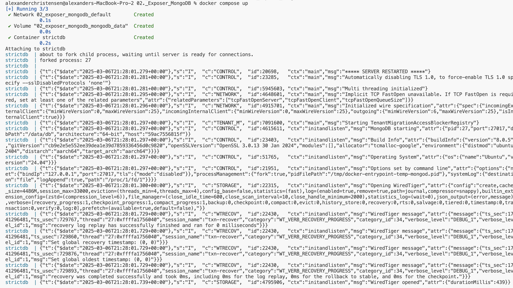
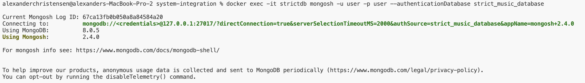
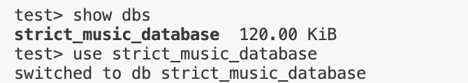
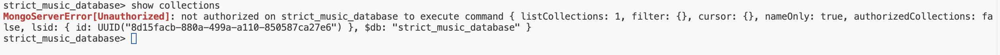
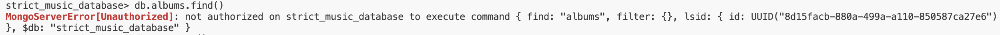
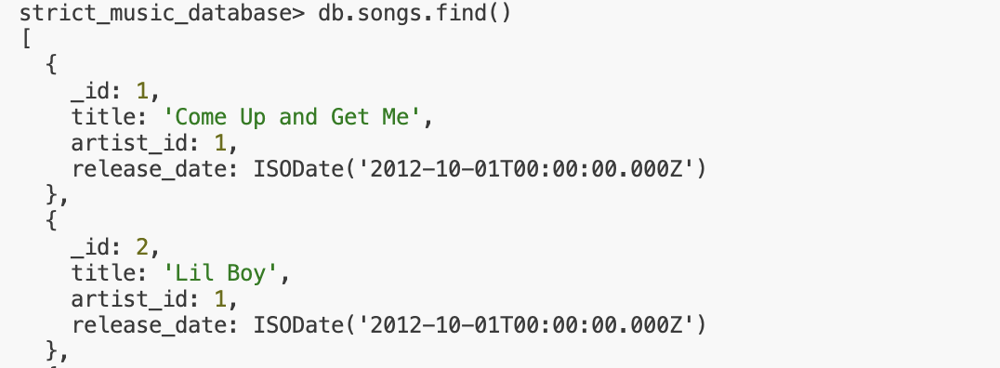

# Integrating Docker based MongoDB

#### 1. executed `docker-compose up --build`

 

---

#### 2. in a new terminal connected to mongodb with user login credentials `docker exec -it strictdb mongosh -u user -p user --authenticationDatabase strict_music_database`

 

---

#### 3. listed dbs and switched to strict_music_database `show dbs; use strict_music_database;`

 

---

#### 4. show collections but fails since not allowed access to all collections`show collections`

 

---

#### 5. show all albums but fails since not allowed access `db.albums.find()`

 

---

#### 6. show all songs 'db.songs.find()`

