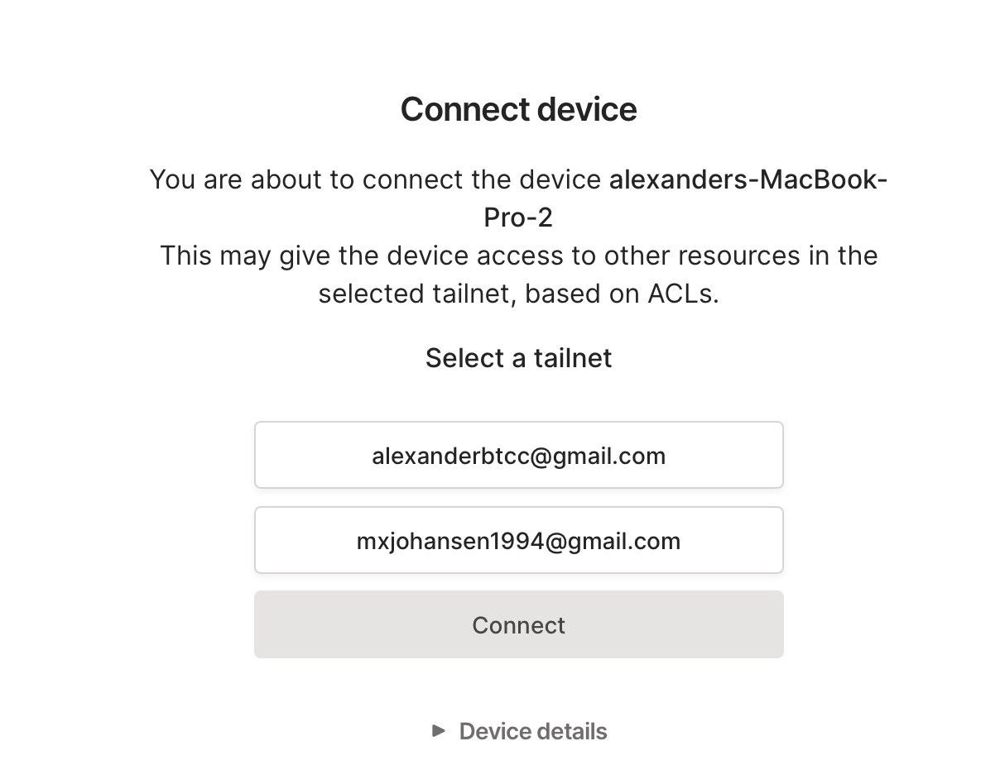
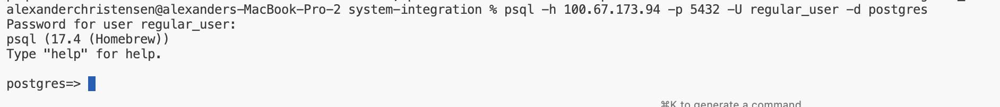
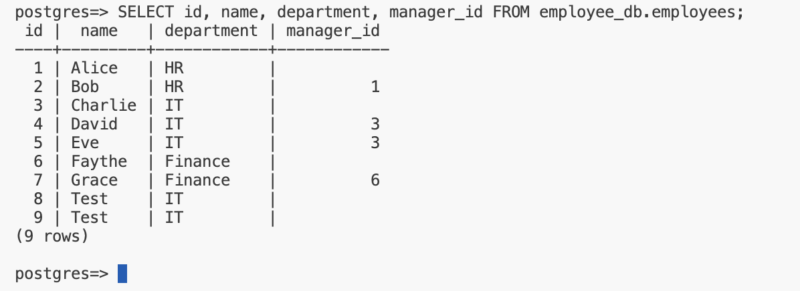
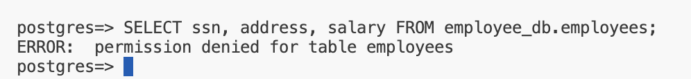
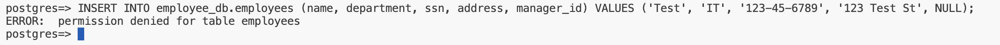
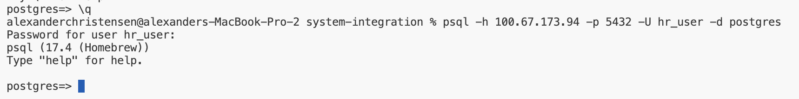
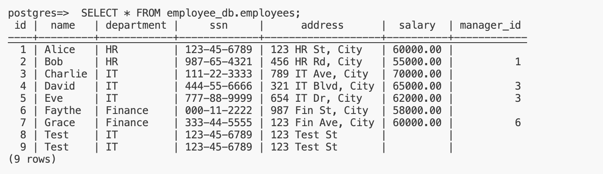
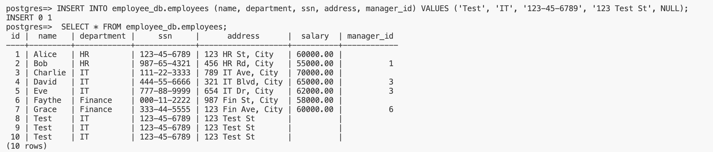
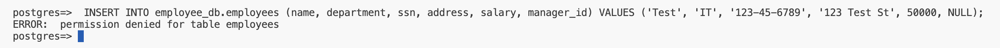

# Integrating PostgreSQL

I followed _mikljohsn_ setup exposing localhosted PostgreSQL database accessible through _Tailscale_ [Exposee repository](https://github.com/mikljohsn/DB_access_PostgreSQL-Tailscale?tab=readme-ov-file)

#### 1. Download and install PostgreSQL 17

```bash
brew install postgresql@17

psql --version
# should output: psql (PostgreSQL) 17.4 (Homebrew)
```

<br>

---

#### 2. Download and install Tailscale

Installed _Tailscale_ at [their website](https://tailscale.com/download/mac) and had further some issues with [authorizing the Tailscale system extension on macOS](https://tailscale.com/kb/1340/macos-sysext), which that guide helped me resolve.

**Join the admins tailnetwork**




<br>

---

#### 3. Connect to the Database via CLI

Use the psql command-line tool to connect to the database. The command will look something like this

```bash
# password: password
psql -h 100.67.173.94 -p 5432 -U regular_user -d postgres
```



<br>

---

#### 4. Perform Queries as regular_user

**Log In as regular_user:**

```bash
psql -h 100.67.173.94 -p 5432 -U regular_user -d postgres
```

**Allowed Queries**
`Select data from permitted columns: SELECT id, name, department, manager_id FROM employee_db.employees;`



**Disallowed Queries**



**Attempt to insert employeeDB**



<br>

---

#### 5. Log Out and Log In as hr_user

**Log Out**

```bash
# Exit the psql session: \q
\q
```

**Log In as hr_user**
`Password: hr_password`

```bash
psql -h 100.67.173.94 -p 5432 -U hr_user -d postgres
```



<br>

---

#### 6. Commands for hr_user

**Allowed Queries**





**Disallowed Queries**


