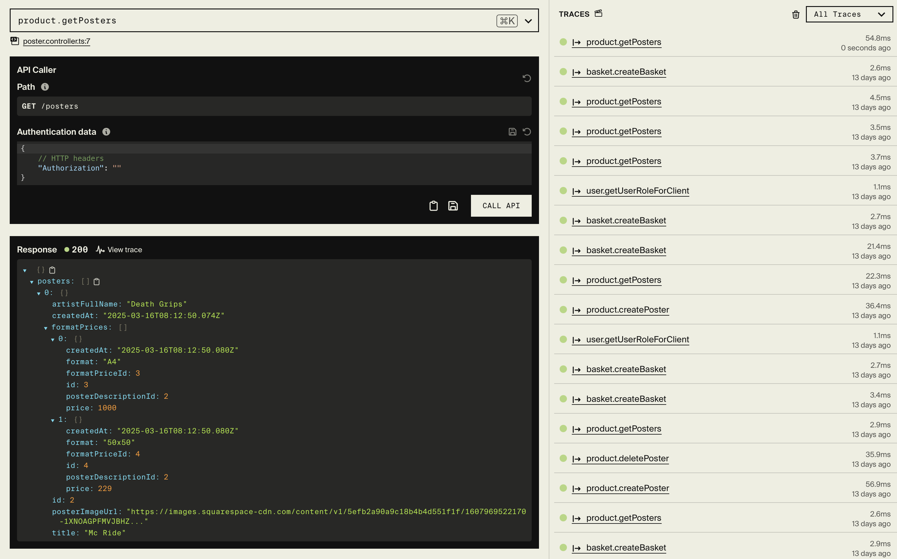

# 08b [DLS Group] Generate code documentation for your DLS project

Been plpaying around with TSDoc for the fun of it which generates a **README.md** based on code comments.

[TSDoc docs](https://tsdoc.org)
[NPM tsdoc-markdown](https://www.npmjs.com/package/tsdoc-markdown#gear-generatedocumentation)
[Medium Article: Typescript: What is TSDoc?](https://medium.com/suyeonme/ts-what-is-tsdoc-6e11427c9704)

## DLS assignment generated code doc

[Generated docs for basket-microservice](https://github.com/realkoder/antik-moderne-dls-encore/blob/develop/backend/README.md)

## DLS assignment based on Encore.ts

The assignments backend system is based upon **Encroe.ts** which is an Open Source TypeScript Backend Framework
for robust type-safe applications.
Encore provides a Service Catalog where it Automatically provides complete API docs for the whole **Encore** system.



#### Bonus

**Encore** provides a script for generating a type-safe client using the most recent API metadata running in a particular environment for the given **Encore** application.

```json
// frontend-package.json scripts section
{
  "scripts": {
    "gen": "encore gen client backend-2tui --output=./app/lib/client.ts --env=local"
  }
}
```
Use the gen script
```bash
# Be placed in frontend-root and ensure encore app is running
npm run gen
```
The above will generate the client for frontend to fetch from __Encore__ application.
