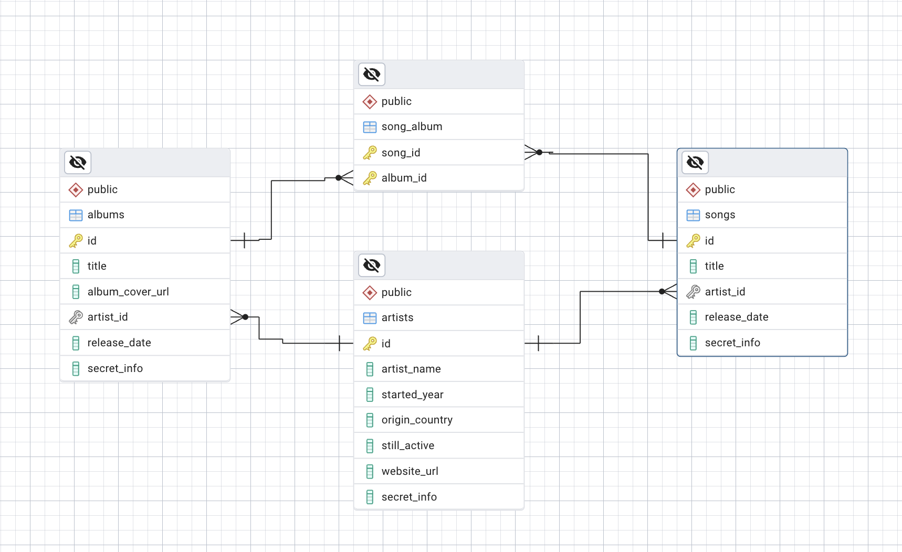

# 08a Document A Database

I have choosen to document the db `music_database` from **10b._Migrate_One_Database_to_Another**.

This project utilizes **Docker Compose** to start a **PostgreSQL** database instance. 

An initialization script **init.sql** is attached to set up a functioning database. This setup allows for easy documentation and management of the database.

Docuementing a database requires both the **DDL** and **DML** statements so a fully functional copy  if the previous databse instance can be generated.

```bash
# Start postgres db instance with docker compose
docker compse up

# Then run the following to generate pgdump.sql
docker compose exec -T postgres pg_dump -U postgres music_database > pgdump.sql
```


Another way to document a database in a more visually aproachable way is an ER digram.
