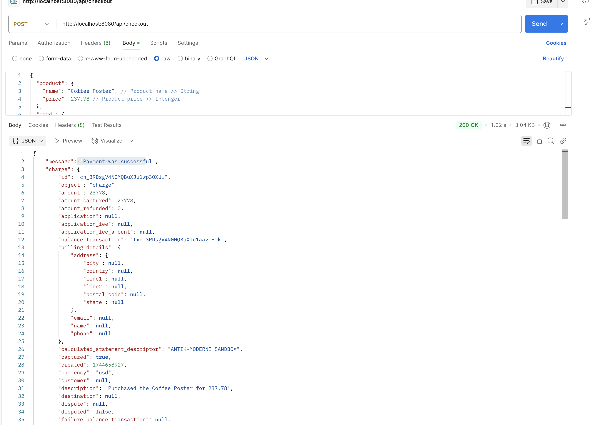

# 💰 Integrate with payment 💰

Chosing _Stripe_ as payment integration due to its robust features and ease of use. _Stripe_ offers a seamless checkout experience with multiple payment methods, including credit cards and digital wallets.
Its comprehensive API allows for customization, while built-in fraud protection ensures secure transactions. Additionally, _Stripe's_ extensive documentation and support make it an ideal choice for efficient implementation and maintenance.

## Researching 📖

When considering payment integration options beyond _Stripe_, it's essential to evaluate the pros and cons of various solutions, including DIY approaches.

### Alternative Payment Integrations

- **PayPal**: A widely recognized payment solution that is easy to set up and supports various payment methods, but has higher transaction fees and limited customization options.
- **DIY**: Building your own payment system allows for full control and customization but requires significant development effort and poses higher security risks.

### DIY Payment Integration

- **Pros**:
  - Full control over the payment process and user experience.
  - Potentially lower transaction fees if using direct bank integrations.
  - Customizable to fit specific business needs and workflows.

- **Cons**:
  - Requires significant development resources and expertise in payment security and compliance (e.g., PCI DSS).
  - Higher initial setup costs and ongoing maintenance efforts.
  - Increased risk of security vulnerabilities if not implemented correctly.

---

<br>

## Step by step integration of Clerk auth

#### 1. Register at Stripe

Go to: https://dashboard.stripe.com/register register and create an organization with needed payment options. Then save the **Publishable key** and **Secret key** from the Developers section of the dashboard since they will be needed soon.

##### 1. Setup the backend application - Express server

For simplicity we will use an _Express_ have a go with following commands for creating the server:

```bash
mkdir stripe-implementation
cd stripe-implementatio

npm init -y

touch app.js .env
```

Ensure that using **ES modules** in `package.json` → `"type": "module",`

##### 2. Installing packages

Install the following packages by npm:

```bash
npm install express cors body-parser dotenv stripe --save
```

##### 3. Setup the backend application - Express server

Go to `app.js` and add following js:

```javascript
import express from "express";
import bodyParser from "body-parser";
import cors from "cors";
import "dotenv/config";

// IMPORT STRIPE
const stripe = require("stripe")(process.env.STRIPE_SECRET_KEY);

// CREATE EXPRESS APP
const app = express();

// MIDDLEWARE
app.use(cors());
app.use(bodyParser.json({ limit: "50mb", extended: true }));

/**
 * ROUTES
 */

// HOME ROUTE
app.get("/", (req, res) => {
  res.send("We are about to build the illest Stripe Payment API...");
});

// CREATE SERVER
const PORT = Number(process.env.PORT ?? 5000);

app.listen(PORT, () => {
  console.log(`Server is running on port ${PORT}`);
});
```

##### 4. Add bootup script

Ensure to add the `dev` script for allowing bootup by `npm run dev`:

```javascript
"scripts": {
    "test": "echo \"Error: no test specified\" && exit 1",
    "dev": "nodemon index.js" // add this line
  },
```

##### 5. Add checkout route

Add a checkout route above the `const PORT` instantation - _Stripe_ [provides testcards](https://docs.stripe.com/testing#cards) while developing and testing the integration:

```javascript
app.post("/api/checkout", async (req, res) => {
  // RECEIVE PRODUCT AND CARD DETAILS FROM CLIENT
  const { product, card } = req.body;

  try {
    // CREATE STRIPE PAYMENT TOKEN
    const stripeToken = await stripe.tokens.create({
      card,
    });
    // CREATE STRIPE CUSTOMER
    const stripeCustomer = await stripe.customers.create({
      email: "test@nishimwe.dev",
      source: stripeToken.id, //
      address: {
        line1: "KK 137 ST",
        postal_code: "10001",
        city: "Kigali",
      },
      shipping: {
        name: "Nishimwe",
        address: {
          line1: "KK 137 ST",
          postal_code: "10001",
          city: "Kigali",
        },
      },
      name: "NISHIMWE",
    });

    // CREATE STRIPE CHARGE
    const stripeCharge = await stripe.charges.create({
      amount: product.price * 100, // To convert to cents
      currency: "usd",
      customer: stripeCustomer.id,
      description: `Purchased the ${product.name} for ${product.price}`,
    });

    // SEND RESPONSE
    res.status(200).json({
      message: "Payment was successful",
      charge: stripeCharge,
    });
  } catch (error) {
    // CATCH ERRORS
    return res.status(500).json({
      error: error.message,
    });
  }
});
```

##### 5. Test checkout with Postman

To test our application, we will open Postman and enter the following details:

**Request URL:** http://localhost:8080/api/checkout
**Request Method:** POST
**Request Body:**

```json
{
  "product": {
    "name": "Coffee Poster", // Product name >> String
    "price": 237.78 // Product price >> Intenger
  },
  "card": {
    "number": "4242424242424242", // This is a VISA card number
    "exp_month": 2, // Choose any valid month of the year
    "exp_year": 2025, // Choose any year in the future
    "cvc": "314" // Any 3 digit number
  }
}
```

##### Whops now this happened since we are not using test API keys


##### 6. Setup test env for Stripe integration

To rely on multiple environments with `dotenv` we need to install [dotenvx](https://github.com/dotenvx/dotenvx)

```bash
npm install @dotenvx/dotenvx --save
```

Add a `.env.develop` file with the same secrets as the default .env, but do add the [Stripe Sandbox API keys](https://docs.stripe.com/keys#obtain-api-keys)

Now update the `dev` script to use `.env.develop`:

```javascript
"scripts": {
    "dev": "dotenvx run --env-file=.env.develop -- nodemon app.js",
    "test": "echo \"Error: no test specified\" && exit 1"
  },
```

##### OKAY That did not solve anything...

Found this on stackoverflow [sending-credit-card-numbers-directly-to-the-stripe-api..](https://stackoverflow.com/questions/76583126/sending-credit-card-numbers-directly-to-the-stripe-api-is-generally-unsafe-we-s)

[Direct charges docs](https://docs.stripe.com/payments/charges-api/connect)
Since we are just testing an getting an error when following the guide see in links section, then we can just get away with our test case by the below `checkout()`:

```javascript
// ✔ ✔ DO THIS ✔ ✔
app.post("/api/checkout", async (req, res) => {
  // RECEIVE PRODUCT AND CARD DETAILS FROM CLIE
  const { product /*card*/ } = req.body;
  try {
    // CREATE STRIPE CHARGE
    const stripeCharge = await stripe.charges.create({
      amount: product.price * 100, // To convert to cents
      currency: "usd",
      source: "tok_visa", // This is the test card
      description: `Purchased the ${product.name} for ${product.price}`,
    });

    // SEND RESPONSE
    res.status(200).json({
      message: "Payment was successful",
      charge: stripeCharge,
    });
  } catch (error) {
    // CATCH ERRORS
    return res.status(500).json({
      error: error.message,
    });
  }
});
```

## HURRAY 🥳 STRIPE HAS BEEN IMPLEMENTED AN READY FOR SIGNUP



---

<br>

## Relevant links

[Add payments feature in your application using Node.js/Express and Stripe](https://dev.to/nishimweprince/add-payments-feature-in-your-application-using-nodejsexpress-and-stripe-305a)
[Stripe - Checkout one time payments](https://github.com/stripe-samples/checkout-one-time-payments)
[Paypal docs](https://developer.paypal.com/home/)
[Paypal docs](https://developer.paypal.com/home/)
[DIY payment in nodejs - paystack-api](https://dev.to/kizito007/creating-a-simple-payment-system-in-nodejs-and-mongodb-using-paystack-a-step-by-step-guide-2mc4)