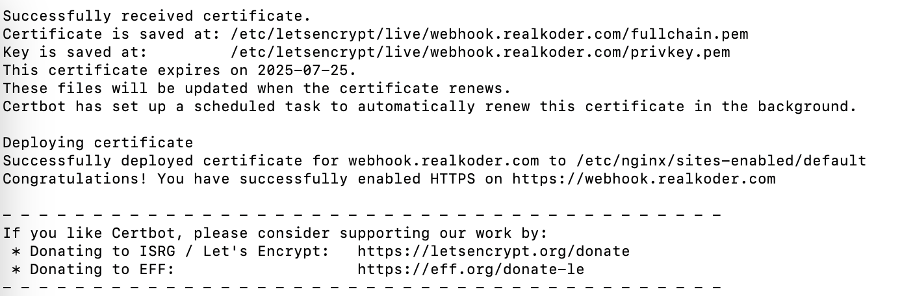

# 12a Expose and Integrate with a Webhook System 🕸️ 🎣 🕸️

The **Webhook system** is for clients to hook on to get real time updates in mocked payment scenarios for a monthly subsciption payment process.
**Expect to receive a payload every minute.**

### Payload

The **payload** to expect for the webhook will be in the following format:

```typescript
interface IPaymentPayload {
  id: string;
  type: "SUCCEEDED" | "DENIED" | "PENDING" | "FAILED";
  created: Date;
  data: {
    id: string;
    subscription_id: string;
    created: Date;
    payment_method: "Paypal" | "MobilePay" | "ApplePay" | "CreditCard" | "BankTransfer";;
  };
  request: {
    id: string;
    idempotency_key: string;
  };
}
```

## How to get hooked 🎣

**1. Setup a POST endpoint to receive post requests with BODY: `payload: IPaymentPayload`**

```javascript
app.post("/my-webhook-url", (req, res) => {
  const payload = req.body;

  // Implement the business logic using the payload

  res.status(200).send({ status: "ok" });
});
```

**2. Ensure your service is running, then expose the PORT for your service through Localtunnel or similar**

```bash
# values could be PORT: 8080, SUBDOMAIN: integrating-webhook
lt --port PORT -s YOUR_SUBDOMAIN
```

**3. Create a POST request to `https://webhook.realkoder.com/register` containing a BODY like below to attach you endpoint to the payment webhook**

```javascript
fetch("https://webhook.realkoder.com/register", {
  method: "POST",
  headers: { "Content-Type": "application/json" },
  body: JSON.stringify({ webhookCallbackUrl: "Hello you have been webhooked" }),
});
```

## HURRAY 🥳 YOU HAVE HOOKED THE WEBHOOK 🕸️ 🎣 🕸️

---

<br>

# Additional documentation on deploying and configuring the codebase with TS & ESM

## Deployment

Running a simple _Ubuntu virtual machine_ on _Linode_, where _nginx_ facilitates _TLS/HTTPS_ and forwards incoming requests to an _Express_ webhook server managed by _Docker Compose_.

Added a subdomain record for my domain _webhook.realkoder.com_:


Access the server to further configure:

```bash
ssh root@139.162.131.241
```

**Install required packages**

```bash
sudo apt update
sudo apt install docker.io docker-compose

# nginx used for forwarding request and enabling https
sudo apt install nginx

sudo apt install certbot python3-certbot-nginx
sudo certbot --nginx -d webhook.realkoder.com
```

Sucessfully created _TLS_ certificate with certbot


Add the following to `/etc/nginx/nginx.conf` inside the _http_ section:

```nginx
	server {
	  listen 443 ssl http2; # managed by Certbot
    server_name webhook.realkoder.com;

    ssl_certificate /etc/letsencrypt/live/webhook.realkoder.com/fullchain.pem; # managed by Certbot
    ssl_certificate_key /etc/letsencrypt/live/webhook.realkoder.com/privkey.pem; # managed by Certbot
    include /etc/letsencrypt/options-ssl-nginx.conf; # managed by Certbot
    ssl_dhparam /etc/letsencrypt/ssl-dhparams.pem; # managed by Certbot

    location / {
      proxy_pass http://localhost:8080;
      proxy_set_header Host $host;
	    proxy_set_header Upgrade $http_upgrade;
	    proxy_set_header Connection "Upgrade";
	    proxy_read_timeout 86400s;
	    proxy_send_timeout 86400s;
      proxy_set_header X-Real-IP $remote_addr;
      proxy_set_header X-Forwarded-For $proxy_add_x_forwarded_for;
      proxy_set_header X-Forwarded-Proto $scheme;
    }
}
```

When `/etc/nginx/nginx.conf` have been updated _nginx_ have to be restarted to enable new configs:

```bash
# Always check nginx.conf is valid
nginx -t

systemctl restart nginx
```

---

**PUSHING DOCKER IMAGE TO GHCR FROM LOCAL DEV ENV**

```bash
docker build --platform linux/amd64 -f Dockerfile.prod -t ghcr.io/realkoder/sys-int-webhook-app:latest .

docker push ghcr.io/realkoder/sys-int-webhook-app:latest
```

---

Add the following `docker-compose.yml` file to _linode ubuntu vm_:

```yml
services:
  webhook-app:
    image: ghcr.io/realkoder/webhook-app:latest
    ports:
      - "8080:8080"
    volumes:
      - ./assets:/app/assets
    environment:
      - NODE_ENV=production
```

**DOCKER ghcr.io LOGIN**

```bash
docker login ghcr.io -u USERNAME --pasword GHCR_TOKEN
```

Ensure that the _ubuntu machine_ has access to **GHCR** and run `docker-compose up`

---

<br>

## Info about configuring express app with TypeScript, Nodemon & ESM

_NodeJS_ RESTAPI backend served by _express_.

So I wanted to have the following setup:

- _nodeJS_ served with `express`
- Using `ESM modules` instead of `commonjs`
- Configured with `typescript`
- Dev mode using `nodemon` for live reloading based on codechanges.

---

Experienced a lot of issues configuring the developer environment since _TypeScript_ is precompiled and interupting nodemon.
Finally managed to do all the config enabling `typescript` with `ESM modules` and live reload by `nodemon`.

Got this error a lot `Object.defineProperty(exports, "__esModule", { value: true }); ReferenceError: exports is not defined in ES module scope` which was related to the use of ESM modules instead of commonJS.

Also followed this guide https://webdev852.medium.com/node-typescript-app-with-nodemon-and-type-module-3e25bfcaa8b0 but took me a while to figure out that the `tsconfig.json` was corrupt since it did then spell `compilerOptions` correctly, and therefor the guide did'nt work either 😭😭😭

After a lot of debugging this was the golden way to create the whole codebase with typescript, ESM modules, express, cors, nodemon:

Config with typescript:

```bash
mkdir backend-app

cd backend-app

npm init -y

npm install express cors @types/cors @types/express @types/node nodemon ts-node typescript
```

Add following to `package.json` --> `"type": "module"` & `"dev": "nodemon --config nodemon.json"`

Add following tsconfig.json

```json
{
  "compilerOptions": {
    "module": "ESNext", // or "ES2020"
    "esModuleInterop": true,
    "target": "es2021",
    "moduleResolution": "node",
    "sourceMap": true,
    "outDir": "dist"
  },
  "lib": ["es2021"]
}
```

Add following nodemon.json

```json
{
  "watch": ["src"],
  "ext": "ts",
  "exec": "node --loader ts-node/esm ./src/app.ts"
}
```
