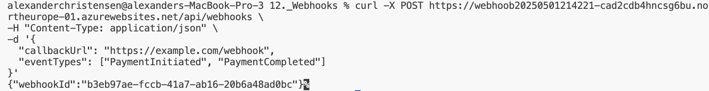
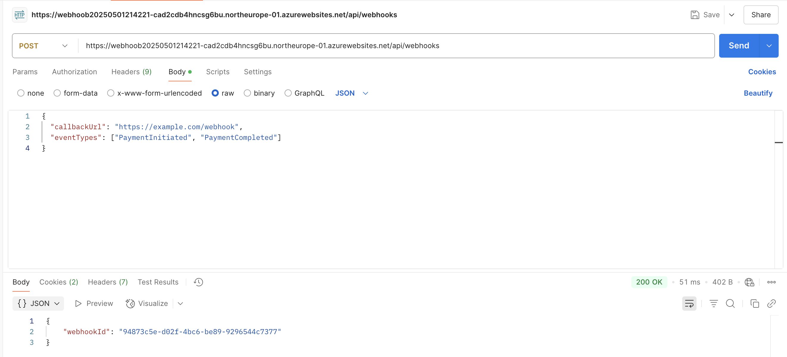
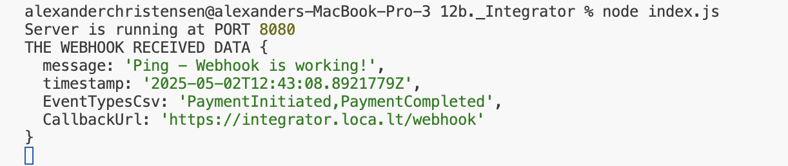

# Integrating the exposed webhook

[Integrated with Shero](https://github.com/Rasho-dk/System_Integration/blob/main/00._Course_Material/01._Assignments/12a._webhook/Expose/Webhoob-dev/Webhoob-dev/README.md#features)

## 1. First the project was created

```bash
npm init -y
touch index.js
```

## 2. Implement the needed endpoint for express server

`/register-webhook` this is needed to register the webhook above.
`/webhook` this is the webhook we gonna attach.

## 3. Make the express server exposed publically for exposed webhook

```bash
lt --p 8080 -s integrator
```

## 4. Start the express server

```bash
node index.js
```

_Server is running and exposed with localtunnel_


## 5. Register the endpoint `/webhook`

CURL is used for that:

```bash
curl -X POST https://webhoob20250501214221-cad2cdb4hncsg6bu.northeurope-01.azurewebsites.net/api/webhooks \
-H "Content-Type: application/json" \
-d '{
  "callbackUrl": "https://example.com/webhook",
  "eventTypes": ["PaymentInitiated", "PaymentCompleted"]
}'
```

_Register with curl_


_Could also be with postman_


## 6. Ping webhook to trigger

_Pinging with postman_


_Received data at my webhook_

