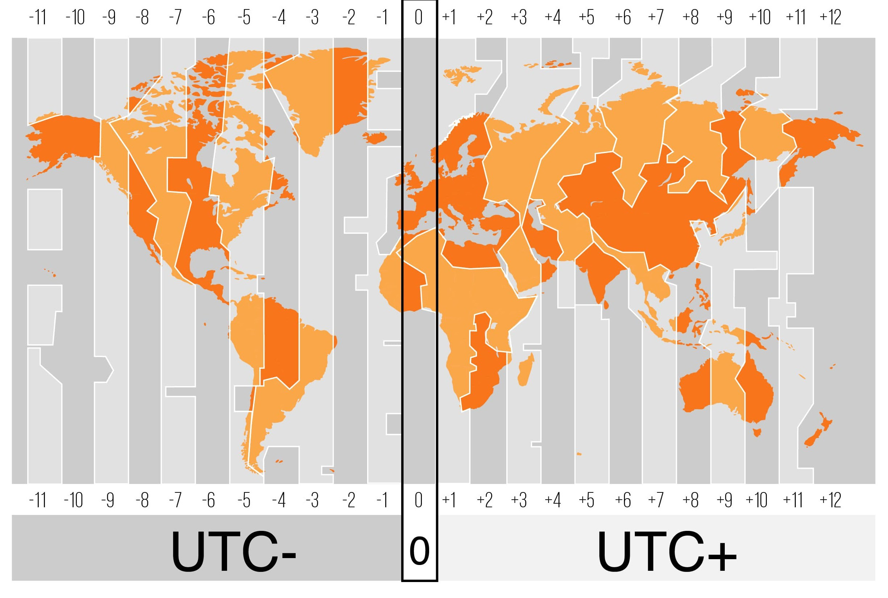

# KEA SoftwareDeveloper - SystemIntegration

> Here will be overall notes and other misc 🧙

## JavaScript

Do have ASI `automatic semicolon insertion`.

<br>

## NodeJS

Everything in node is a module. A file is considered a module.

### NodeJS with Typescript

Had a lot of issues regarding the use of `ES modules` instead of `commonjs` and importing files. First I thought it should be imported with extension `.ts`, which worked when setting the `tsconfig` file up for that. But making use of `"noEmit": true, "allowImportingTsExtensions": true` in tsconfig messed with `npm run build` since the `.ts` files couldn't be imported for the emitted js files.

This video explains it somehow -> https://www.youtube.com/watch?v=8ORIzvgNWhU

<br>

---

<br>

## Serialization

`Marshalling` is the process where an endpoint accepting an incoming request containing a string in `JSON` format, which could be processed in a `Java` environment using `Jackson's ObjectMapper` to convert the JSON string to a Java object.

<br>

## Python

`Poetry` is a mature build system for Python. It configures a `venv` and sets up a `pyproject.toml` file for specification about project regarding metadata, scripts, dependencies.

```bash
# Initialize with default settings
poetry init -n

# Install dependencies e.g emoji
poetry add emoji

# Init the venv
poetry shell

# Leave the venv
exit
```

To set the `interpreter` to the poetry venv its placed here `/Users/alexanderchristensen/Library/Caches/pypoetry/virtualenvs/03-poetry-RN3a7CP4-py3.13/bin/python` MAKE SURE TO POINT TO THE EXACT NAME `03-poetry-RN3a7CP4-py3.13`.

To fix the issue with `poetry shell` where getting error `The command "shell" does not exist.` Fix it by this -> https://github.com/python-poetry/poetry-plugin-shell

```bash
# The easiest way to install the shell plugin is via the self add command of Poetry.
poetry self add poetry-plugin-shell
```

A simple server is configured by `fastapi` run with `uvicorn` since it's an `ASGI (Asynchronous Server Gateway Interface)`

```bash
# install deps with poetry
poetry add fastapi uvicorn

# Execute main.py with uvicorn
uvicorn main:app --reload
```

<br>

## Standards (ISO)

**ISO 9126** International standard for ensuring the quality for software products.

[How to Think About Time - for programmers, and people who like to know things](https://errorprone.info/docs/time)

### Time

POSIX = Unix Epoch
Amount of seconds since _1970-01-01_
It doesn't take leap seconds into account

UTC (Coordinated Universal Time) is the primary time standard by which the world regulates clocks and time. It is effectively a successor to Greenwich Mean Time (GMT).



> Description about IANA from their website

The [Time Zone Database](https://www.iana.org/time-zones) (often called tz or zoneinfo) contains code and data that represent the history of local time for many representative locations around the globe. It is updated periodically to reflect changes made by political bodies to time zone boundaries, UTC offsets, and daylight-saving rules. Its management procedure is documented in BCP 175: Procedures for Maintaining the Time Zone Database.

[Time formatting and storage bugs](https://en.wikipedia.org/wiki/Time_formatting_and_storage_bugs)

#### Dates in js

```js
const UTC_DATE = new Date(); // UTC Standard ISO 8601
const LOCAL_DATE = Date(); // Local Date
const UNIX_EPOCH_DATE = Date.now(); // POSIX / Unix Epoch

// ============== OUTPUT ==============
// UTC_DATE 2025-02-20T07:57:07.082Z
// LOCAL_DATE 2025-02-20T07:57:07.082Z
// UNIX_EPOCH_DATE 1740038227082

const danishDate = new Intl.DateTimeFormat("da-dk").format(UTC_DATE);
// ============== OUTPUT ==============
// danishDate 20.2.2025
```

<br>

## Bonus info

Very nice way to serve html,css,js files for local dev in browser `npx vite`.

Encode a string to base-64 use `btoa` decode use `atob`.

```js
const message = "hello world";

const encoded = btoa(message);
const decoded = atob(encoded);

console.log(encoded);
console.log(decoded);
```

## LINKS

[Can I use provides up-to-date browser support tables for support of front-end web technologies on desktop and mobile web browsers](https://caniuse.com)

[The WebSocket Protocol](https://datatracker.ietf.org/doc/html/rfc6455)

[Differences between Socket.IO and WebSocket](https://stackoverflow.com/questions/10112178/differences-between-socket-io-and-websockets)