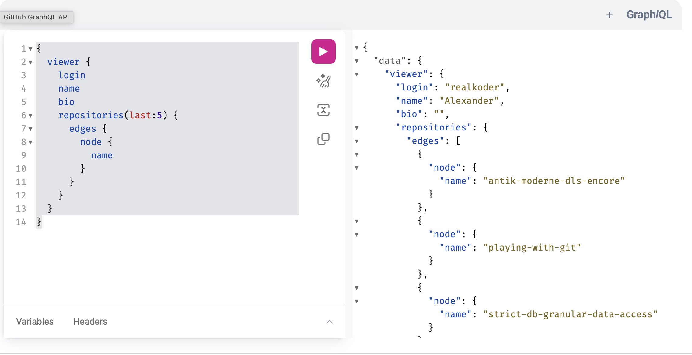

# KEA SoftwareDeveloper - SystemIntegration

> Here will be overall notes and other misc 🧙

## JavaScript

Do have ASI `automatic semicolon insertion`.

<br>

## NodeJS

Everything in node is a module. A file is considered a module.

### NodeJS with Typescript

Had a lot of issues regarding the use of `ES modules` instead of `commonjs` and importing files. First I thought it should be imported with extension `.ts`, which worked when setting the `tsconfig` file up for that. But making use of `"noEmit": true, "allowImportingTsExtensions": true` in tsconfig messed with `npm run build` since the `.ts` files couldn't be imported for the emitted js files.

This video explains it somehow -> https://www.youtube.com/watch?v=8ORIzvgNWhU

<br>

---

<br>

## Serialization

`Marshalling` is the process where an endpoint accepting an incoming request containing a string in `JSON` format, which could be processed in a `Java` environment using `Jackson's ObjectMapper` to convert the JSON string to a Java object.

<br>

## Python

`Poetry` is a mature build system for Python. It configures a `venv` and sets up a `pyproject.toml` file for specification about project regarding metadata, scripts, dependencies.

```bash
# Initialize with default settings
poetry init -n

# Install dependencies e.g emoji
poetry add emoji

# Init the venv
poetry shell

# Leave the venv
exit
```

To set the `interpreter` to the poetry venv its placed here `/Users/alexanderchristensen/Library/Caches/pypoetry/virtualenvs/03-poetry-RN3a7CP4-py3.13/bin/python` MAKE SURE TO POINT TO THE EXACT NAME `03-poetry-RN3a7CP4-py3.13`.

To fix the issue with `poetry shell` where getting error `The command "shell" does not exist.` Fix it by this -> https://github.com/python-poetry/poetry-plugin-shell

```bash
# The easiest way to install the shell plugin is via the self add command of Poetry.
poetry self add poetry-plugin-shell
```

A simple server is configured by `fastapi` run with `uvicorn` since it's an `ASGI (Asynchronous Server Gateway Interface)`

```bash
# install deps with poetry
poetry add fastapi uvicorn

# Execute main.py with uvicorn
uvicorn main:app --reload
```

<br>

## Standards (ISO)

**ISO 9126** International standard for ensuring the quality for software products.

[How to Think About Time - for programmers, and people who like to know things](https://errorprone.info/docs/time)

### Time

POSIX = Unix Epoch
Amount of seconds since _1970-01-01_
It doesn't take leap seconds into account

UTC (Coordinated Universal Time) is the primary time standard by which the world regulates clocks and time. It is effectively a successor to Greenwich Mean Time (GMT).


> Description about IANA from their website

The [Time Zone Database](https://www.iana.org/time-zones) (often called tz or zoneinfo) contains code and data that represent the history of local time for many representative locations around the globe. It is updated periodically to reflect changes made by political bodies to time zone boundaries, UTC offsets, and daylight-saving rules. Its management procedure is documented in BCP 175: Procedures for Maintaining the Time Zone Database.

[Time formatting and storage bugs](https://en.wikipedia.org/wiki/Time_formatting_and_storage_bugs)

#### Dates in js

```js
const UTC_DATE = new Date(); // UTC Standard ISO 8601
const LOCAL_DATE = Date(); // Local Date
const UNIX_EPOCH_DATE = Date.now(); // POSIX / Unix Epoch

// ============== OUTPUT ==============
// UTC_DATE 2025-02-20T07:57:07.082Z
// LOCAL_DATE 2025-02-20T07:57:07.082Z
// UNIX_EPOCH_DATE 1740038227082

const danishDate = new Intl.DateTimeFormat("da-dk").format(UTC_DATE);
// ============== OUTPUT ==============
// danishDate 20.2.2025
```

<br>

## Peer-to-peer

The protocol is BitTorrent
Tracker: A server that keeps track of peers participating in a torrent swarm.

**Swarm**: The group of peers participating in a torrent.

**Torrent file**: Contains metadata about the content, piece hashes for validation and optionally the tracker URL.

**Block**: The smallest unit of data that can be requested from a peer. Enables parallel downloading out of order.

---

<br>

## LocalTunnel

**LocalTunnel** is a tool that exposes your local development server to the internet, making it easy to share projects and test webhooks.

### Key Features:

- **Easy Setup**: Install via npm with `npm install -g localtunnel`.
- **Custom Subdomains**: Specify a subdomain for easier sharing:

  ```bash
  lt --port 8080 -s <subdomain>
  ```

- **Temporary URLs**: Generated URLs are temporary unless a custom subdomain is used.

### Use Cases:

- Share local projects with clients or team members.
- Test webhooks from services like Stripe.
- Facilitate collaborative development.

LocalTunnel simplifies the process of making local servers accessible online.

---

<br>

### FFMPEG

**FFmpeg** is a powerful open-source multimedia framework that allows you to record, convert, and stream audio and video files. It supports a wide range of formats and codecs, making it an essential tool for developers and content creators working with multimedia content.

#### Key Features:

- **Format Conversion**: FFmpeg can convert multimedia files between different formats, enabling compatibility across various platforms and devices.
- **Video and Audio Processing**: It provides tools for editing, filtering, and manipulating audio and video streams, including resizing, cropping, and applying effects.
- **Streaming**: FFmpeg supports real-time streaming of audio and video over networks, making it suitable for live broadcasting applications.
- **Command-Line Interface**: FFmpeg is primarily used through a command-line interface, allowing for automation and integration into scripts and applications.

#### Installation

You can easily install FFmpeg on macOS using Homebrew with the following command:

```bash
brew install ffmpeg
```

Command to work on a video MPEG-DASH

```bash
ffmpeg -i input.mp4 \
-map 0:v -map 0:a -b:v:0 200k -s:v:0 426x240 -profile:v:0 baseline -b:a:0 48k \
-map 0:v -map 0:a -b:v:1 400k -s:v:1 640x360 -profile:v:1 baseline -b:a:1 64k \
-map 0:v -map 0:a -b:v:2 800k -s:v:2 854x480 -profile:v:2 main     -b:a:2 96k \
-map 0:v -map 0:a -b:v:3 1200k -s:v:3 960x540 -profile:v:3 main    -b:a:3 96k \
-map 0:v -map 0:a -b:v:4 1800k -s:v:4 1280x720 -profile:v:4 high   -b:a:4 128k \
-map 0:v -map 0:a -b:v:5 2500k -s:v:5 1920x1080 -profile:v:5 high  -b:a:5 160k \
-f dash playlist.mpd
```

---

<br>

## GraphQL

GraphQL is a query language for APIs and a runtime for executing those queries with your existing data. It provides a more efficient, powerful, and flexible alternative to RESTful APIs.
It fixes **underfetching & overfetching**

1. Query

```graphql
{
  user(id: "1") {
    name
    email
  }
}
```

2. mutation

```graphql
mutation {
  createUser(name: "John Doe", email: "john@example.com") {
    id
    name
  }
}
```

3. Subscription

```graphql
subscription {
  messageSent {
    id
    content
    sender {
      name
    }
  }
}
```


_Github Graphql repos_

---


_Github Graphql variables usage for issues_

---

<br>

## Bonus info

Very nice way to serve html,css,js files for local dev in browser `npx vite`.

Encode a string to base-64 use `btoa` decode use `atob`.

```js
const message = "hello world";

const encoded = btoa(message);
const decoded = atob(encoded);

console.log(encoded);
console.log(decoded);
```

**Websockets** & **WebRTC** where published at the same time.

**Signalling** when a server connects a client with another client: the stablishment of **peer-to-peer**

[Iana MIMEtypes list](https://www.iana.org/assignments/media-types/media-types.xhtml)

## LINKS

[Can I use provides up-to-date browser support tables for support of front-end web technologies on desktop and mobile web browsers](https://caniuse.com)

[The WebSocket Protocol](https://datatracker.ietf.org/doc/html/rfc6455)

[Differences between Socket.IO and WebSocket](https://stackoverflow.com/questions/10112178/differences-between-socket-io-and-websockets)
